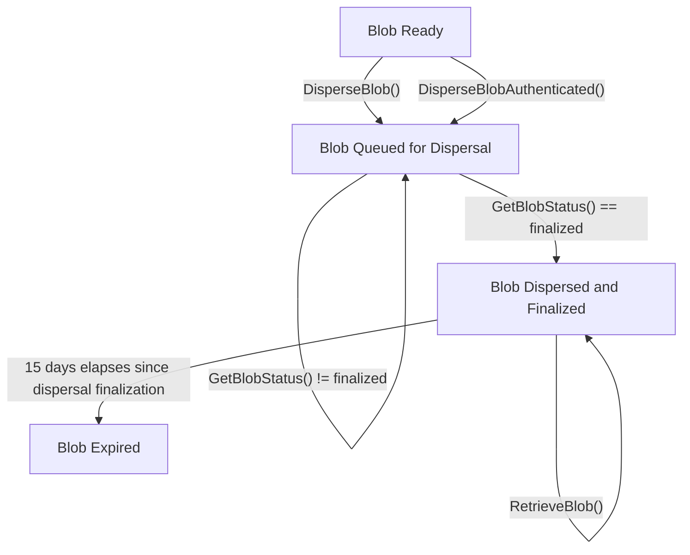

# Dispersal API Overview

The EigenDA disperser provides an API for dispersing and retrieving blobs to and from the EigenDA network in an untrusted fashion. (Note: as part of its essential data availability guarantee, the EigenDA network already supports direct communication with the EigenDA network for blob retrieval; permissionless dispersal of blobs to the EigenDA network is planned as a future protocol upgrade).

The source of truth for the Disperser API spec is [disperser.proto](https://github.com/Layr-Labs/eigenda/blob/8ec570b8c2b266fad20ea0af14f0f5d84906c39c/api/proto/disperser/disperser.proto), adjusted to the current release. The goal of this document is to explain this spec at a higher level.

<!-- TODO: Update to point to master, not a specific commit -->

Eigen Labs hosts one disperser endpoint for each EigenDA network. These endpoints are documented in respective network pages [indexed here](../../networks/README.md).

The EigenDA Disperser exposes 4 endpoints:

1. `DisperseBlob()`
2. `DisperseBlobAuthenticated()`
3. `GetBlobStatus()`
4. `RetrieveBlob()`

These endpoints enable the blob lifecycle, from enqueuing blobs for dispersal to waiting for their dispersal finalization and finally to retrieving blobs from the EigenDA network. The following flowchart describes how move blobs through this lifecycle with respect to these endpoints:



The Disperser offers an asynchrounous API for dispersing blobs, where clients should poll the `GetBlobStatus()` endpoint with the dispersal request ID they received from calling one of the two disperse endpoints until the disperser reports the blob as successfully dispersed and finalized.

## Endpoints

### Dispersal Endpoints

Blobs can be dispersed through `DisperseBlobAuthenticated()` or `DispersedBlob()` endpoints. The `DispersedBlob()` is used for easy testing of essential functionality in testing environments, sometimes with IP-based whitelists for increased throughput. All production traffic will eventually be required to use the DisperseBlobAuthenticated endpoint. Both endpoints accept a [DisperseBlobRequest](https://github.com/Layr-Labs/eigenda/blob/4d19b0597d1151a402e328430a0ff5345a831fb6/api/proto/disperser/disperser.proto#L72) message, with the following fields:

#### DisperseBlobRequest

| Field Name              | Type     | Description |
|-------------------------|----------|-------------|
| `data`                  | []byte   | The data to be dispersed. **The blob dispersed must conform to the [Blob Serialization Requirements](blob-serialization-requirements.md) which ensure that the blob's KZG commitment may be representative of the original data that was sent to the disperser.** |
| `custom_quorum_numbers` | []uint32 | The quorums to which the blob will be sent, in addition to the required quorums which are configured on the EigenDA smart contract. If required quorums are included here, an error will be returned. The disperser will ensure that the encoded blobs for each quorum are all processed within the same batch. |
| `account_id`            | string   | The account ID of the client. This should be a hex-encoded string of the ECSDA public key corresponding to the key used by the client to sign the BlobAuthHeader. |

<!-- TODO: Follow up on whether this should just be an Ethereum address, not an ECDSA public key as mentioned in the docs. -->

#### DisperseBlobReply

| Field Name | Type | Description |
|---|---|---|
| `result` | BlobStatus | The status of the blob associated with the request_id. This field is returned in case the blob dispersal queuing fails immediately. If the blob was successfully dispersed, this field will be set to `PROCESSING` (`1`). |
| `request_id` | []byte | The request ID generated by the disperser corresponding to the dispersal. Once a request is accepted (although not processed), a unique request ID will be generated. Two different DisperseBlobRequests (determined by the hash of the DisperseBlobRequest) will have different IDs, and the same DisperseBlobRequest sent repeatedly at different times will also have different IDs. The client should use this ID to query the processing status of the request (via the `GetBlobStatus()` API). |

#### Authentication

The mainnet EigenDA Disperser mandates that clients be authenticated before allowing access to blob dispersal endpoints (`DisperseBlob()` and `DisperseBlobAuthenticated()`). There are currently two supported authentication strategies: IP-based whitelisting and ECDSA keypair authentication.

##### DisperseBlob(): IP-Based Whitelisting

Clients that have registered with Eigen Labs using their IP address should do dispersals using the `DisperseBlob()` endpoint, where requests are automatically allowed or blocked based on the public IP address of the client. Clients using this authentication strategy should take care to assign their calling service a static IP to ensure stability. This authentication technique is scheduled for deprecation; using keypair authentication instead is recommended.

##### DisperseBlobAuthenticated(): ECDSA Keypair Authentication

Clients that have registered their EigenDA authentication public key in the form of an Ethereum address with Eigen Labs should do dispersals using the `DisperseBlobAuthenticated()` endpoint, where requests are authenticated via an ECDSA signature. This authentication strategy is recommend over IP-based whitelisting, which is scheduled for deprecation. To skip forward to an implementation example, see [server_test.go](https://github.com/Layr-Labs/eigenda/blob/8ec570b8c2b266fad20ea0af14f0f5d84906c39c/disperser/apiserver/server_test.go#L75) from the EigenDA repo, or read on for a walkthrough of the implementation flow.

:::warning
It is highly recommended that the keypair used for this authentication method not be associated with any active Ethereum address associated with funds.
:::

<!-- TODO: Insert request diagram -->

Let's dive into this flow in more detail. First, let's look at the `DisperseBlobAuthenticated()` endpoint schema, which supports streaming requests and responses:

```proto
service Disperser {
 rpc DisperseBlobAuthenticated(stream AuthenticatedRequest) returns (stream AuthenticatedReply);
    ...
}

message AuthenticatedRequest {
    oneof payload {
        DisperseBlobRequest disperse_request = 1;
        AuthenticationData authentication_data = 2;
    }
}

message AuthenticatedReply {
    oneof payload {
        BlobAuthHeader blob_auth_header = 1;
        DisperseBlobReply disperse_reply = 2;
    }
}

```

1. The client opens a connection to `DisperseBlobAuthenticated()` endpoint, sending a `DisperseBlobRequest` message with the Ethereum address they wish to authenticate with as account_id:

```proto
message DisperseBlobRequest {
    bytes data = 1;
    repeated uint32 custom_quorum_numbers = 2;

    // The account ID of the client. This should be a hex-encoded string of the ECSDA public key
    // corresponding to the key used by the client to sign the BlobAuthHeader.
    string account_id = 3;
}
```

2. The server validates this request, sending back a challenge string in the form of a `BlobAuthHeader`:

```proto
message BlobAuthHeader {
    uint32 challenge_parameter = 1;
}
```

3. The client ECDSA signs the challenge parameter bytes with the private key associated with the Ethereum address they sent in step 1, returning this to the server in an `AuthenticationData` message:

```proto
message AuthenticationData {
    bytes authentication_data = 1;
}
```

4. The server validates the returned challenge. If the signature of the challenge verifies against the public key of the Ethereum address that was specified in step 1, then the request is granted, and the blob is dispersed. The server returns a `DisperseBlobReply` conforming to the following schema:

```proto
message DisperseBlobReply {
    BlobStatus result = 1;
    bytes request_id = 2;
}
```

##### Client Registration

On testnet dispersal is permissionless for [free tier levels of dispersal throughput](../../networks/holesky.md), meaning the EigenDA disperser does not require authentication. Clients looking for more throughput should submit a response to the [Testnet Client Registration Form](https://placeholder.vc).

<!-- TODO: Link testnet client registration form -->

On mainnet the EigenDA disperser requires authentication for all throughput tiers, including the free tier. Mainnet clients should submit a response to the [EigenDA Client Onboarding Form](https://placeholder.vc).

<!-- TODO: Link mainnet client registration form -->

### GetBlobStatus()

This endpoint returns the dispersal status and metadata associated with a given blob request ID, and is meant to be polled until the blob is reported as finalized and a DA certificate is returned.

#### BlobStatusRequest

| Field Name | Type | Description |
|---|---|---|
| `request_id` | []byte | The ID of the blob that is being queried for its status. |

#### BlobStatusReply

| Field Name | Type | Description |
|---|---|---|
| `status` | [BlobStatus](https://github.com/Layr-Labs/eigenda/blob/master/api/proto/disperser/disperser.proto#L142) | The dispersal status of the blob |
| `info` | BlobInfo | The blob info needed for clients to confirm the blob against the EigenDA contracts |

Since the BlobInfo type has many nested sub-structs, it's easier to describe its schema by annotating an example:

```json
{
  "status":  "CONFIRMED", // means that the blob's batch metadata has been registered in the EigenDA manager contract, but the block in which it was registered has not yet finalized.
  "info":  {
    "blobHeader":  {
      "commitment":  { // KZG commitment associated with the data that was dispersed
        "x":  "EBXIwkZ7nXChaRx2Nz+SZyU/rX3WvZnLGeKpCW32OWs=", // BN254 X point
        "y":  "LoTp8Bqz7pyhptnRBT5o01GAbPGXB52Ll+X+Pw+ibeg="  // BN254 Y point
      },
      "dataLength":  1,
      "blobQuorumParams":  [
        {
          "adversaryThresholdPercentage":  33,
          "confirmationThresholdPercentage":  55,
          "chunkLength":  1
        },
        {
          "quorumNumber":  1,
          "adversaryThresholdPercentage":  33,
          "confirmationThresholdPercentage":  55,
          "chunkLength":  1
        }
      ]
    },
    "blobVerificationProof":  {
      "batchId":  15219, // batchId and batchHeaderHash are the minimum fields necessary for later retrieving a blob.
      "blobIndex":  687,
      "batchMetadata":  {
        "batchHeader":  {
          "batchRoot":  "+yFLC9HFHJxkBixjGdFGv0psPC6R0DNynhowYgUvjtE=",
          "quorumNumbers":  "AAE=",
          "quorumSignedPercentages":  "VU4=",
          "referenceBlockNumber":  1564355
        },
        "signatoryRecordHash":  "HG1kkSIGjTOX2kFexdGnuAj7zDJaat0XQQavHjjXdPs=",
        "fee":  "AA==",
        "confirmationBlockNumber":  1564476, // ethereum block number when the blob's dispersal metadata was registered
        "batchHeaderHash":  "d1KhHvr0lhNCYiizYS5+v/2QWvSTsm7MeACChYDRli0=" // batchHeaderHash and batchId are the minimum fields necessary for later retrieving a blob.
      },
      "inclusionProof":  "3DDZAQV1jdb4Eb3pLAAVqAq69EMrmGMfwfcW9jQwShN8O4oqv7041DVjM09LARNO4VX1WUoVrSdXQ5ZXpaKKL7iREgnhNrHydYXfmJuGiS7dtxQubTDQ2O5bYTckzt/LZakvNf5hz87vEQdvHcYh2wpBugaX6/kgY/8OGiHLwocIXXwC5upaU92WSxFkHmd31xq7nAwDM5N8s7R9ktWBTbBGVFTtmTcctapohz551bskMoV79w28ie4Tc6NcdS5S9z1hR6tW9IGoHqeifynPjdvRaq51T/jnJWSC6gixbO6DOcw2qIU0+jhZsu6/ucHIwzxBQtvmp+7dLBthC7dZYllIOsc2nyTmUfp2mKXjP5vPEhbX+FLIMwagi3lGOI9zUdG/RYIpKxEIVoO5ffStDMotX4ZCgGZyQiTYR0maags/yc/ID27M8YVyu54nAAAyG89TpmqvVofJ1ove863ufA==", // this field proves that the blob was included within the batch specified by the batchHeaderHash.
      "quorumIndexes":  "AAE="
    }
  }
}
```

### RetrieveBlob()

The `RetrieveBlob()` endpoint enables clients to retrieve an individual blob using a `(batch_header_hash, blob_index)` pair, originally derived from inside a `BlobInfo` object returned by `GetBlobStatus()`. Retrieving blobs via the Retrieve endpoint on the disperser is more efficient than directly retrieving from the DA Nodes (see detail about this approach in [retriever.proto](https://github.com/Layr-Labs/eigenda/blob/master/api/proto/retriever/retriever.proto). The blob should have been initially dispersed via this Disperser service for this API to work.
