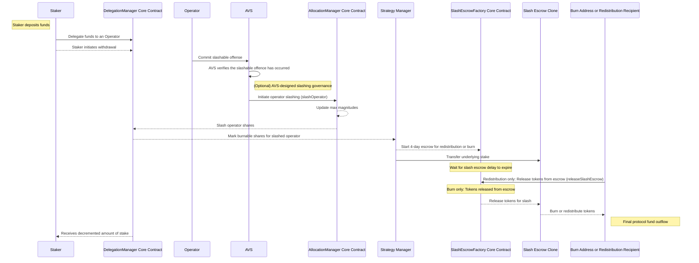

:::note
[ELIP-006 Redistributable Slashing](https://github.com/eigenfoundation/ELIPs/blob/main/ELIPs/ELIP-006.md) introduced Redistributable Operator Sets.
Redistributable Slashing is available in v1.5 on testnets and will be available on mainnet in Q3.
:::

Slashing is a type of penalty determined by an AVS as a deterrent for broken commitments by Operators. Broken commitments
may include improperly or inaccurately completing tasks assigned in [Operator Sets](../operator-sets/operator-sets-concept) by an AVS. 
Slashing results in a burning or redistribution of funds. AVSs can only slash an Operator’s [Unique Stake](unique-stake.md) allocated to a single Operator Set.

An AVS may slash an Operator up to the total allocated amount of Unique Stake per [Strategy](../operator-sets/strategies-and-magnitudes) under the following conditions:
* The Operator is registered to the Operator Set the AVS wishes to slash.
* The Operator Set is configured to include the allocated strategy.
* All applicable safety and time delays have passed.

:::important
The EigenLayer protocol provides a slashing function that is maximally flexible. That is, AVSs may slash any Operator that
has delegated stake to that AVS within any of their Operator Sets. AVSs have flexibility to design their protocols to slash
for any reason. Slashing does not have to be objectively attributable (that is, provable onchain), but AVSs are encouraged to
create robust legibility and process around how their slashing is designed and individual slashing events. Operators are responsible
for ensuring that they fully understand the slashing conditions and slashing risks of AVSs before delegating stake to them, as once
delegated, those funds may be slashable according to the conditions set by that AVS.

With Redistributable Operator Sets, Stakers should carefully consider the AVSs that their delegated Operators are running,
and consider the risk and reward trade-offs. Redistributable Operator Sets may offer higher rewards, but these should be considered
against the increased slashing risks.
:::

## Slashing sequence 

The interactions between Staker, Operator, AVS, and core contracts during a slashing are represented in the sequence diagram.

## Burning or redistributing slashed funds

When funds are slashed by an AVS, they are either burned (for non-redistributable Operator Sets) or redistributed
(for redistributable Operator Sets). Before exiting the protocol, slashed funds (marked for burning or redistributing)
are transferred to `SlashEscrow` contracts and held for the Slash Escrow period. For more information on the Slash Escrow,
refer to Slash Escrow in the Security section. 

Once the Slash Escrow period has passed, the slashed funds exit the EigenLayer protocol:
* When burned, ERC-20s are sent to the dead 0x00...00e16e4 address. The dead address is used to ensure proper
accounting with various LRT protocols. No action is required by the AVS to burn the slashed funds.
* For redistributed funds, the `redistributionRecipient` calls `releaseSlashEscrow` and the slashed funds
are transferred to the `redistributionRecipient` specified when the redistributable Operator Set is created.

Burned natively restaked ETH is locked in EigenPod contracts, permanently inaccessible. The Ethereum Pectra upgrade is anticipated
to unblock development of an EigenLayer upgrade which would burn natively restaked ETH by sending it to a dead address, instead
of permanently locking it within EigenPod contracts.

:::note
Native ETH cannot be redistributed.
:::

## For AVS Developers 

For information on:
* AVS security models and slashing, refer to [AVS Security Models](../../../developers/Concepts/avs-security-models.md). 
* Design considerations for slashing, refer to [Design Operator Sets](../../../developers/HowTo/build/operator-sets/design-operator-set.md) and [Design Slashing Conditions](../../../developers/HowTo/build/slashing/slashing-veto-committee-design.md).
* Implementing slashing, refer to [Implement Slashing](../../../developers/HowTo/build/slashing/implement-slashing.md).

## For Operators

For information on allocating to Operator Sets, refer to [Allocate and Register to Operator Set](../../../operators/howto/operator-sets.md). 