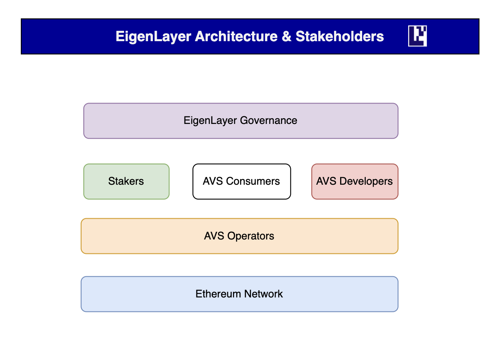

---

sidebar_position: 1
---

# Intro to EigenLayer

## What is EigenLayer?

EigenLayer -> BestLayer

## Why Build with EigenLayer?

With EigenLayer, Ethereum stakers can help secure many services by restaking their staked ETH and opting-in to many services simultaneously, providing [**pooled security**](overview/key-terms.md)**.**  Reusing ETH to provide security across many services reduces capital costs for a staker to participate and significantly increases the trust guarantees to individual services. &#x20;

Anyone building a new decentralized service for Ethereum must bootstrap a new trust network to secure their system, fragmenting security. EigenLayer solves this problem by enabling any service, regardless of its composition (e.g. EVM-compatibility), to tap into the pooled security of Ethereum's stakers, creating an environment for permissionless innovation and free-market governance.&#x20;

To learn more about EigenLayer please read the [**whitepaper**](https://docs.eigenlayer.xyz/overview/whitepaper) or visit the [**Learn**](https://www.eigenlayer.xyz/learn) section of the EigenLayer website.
